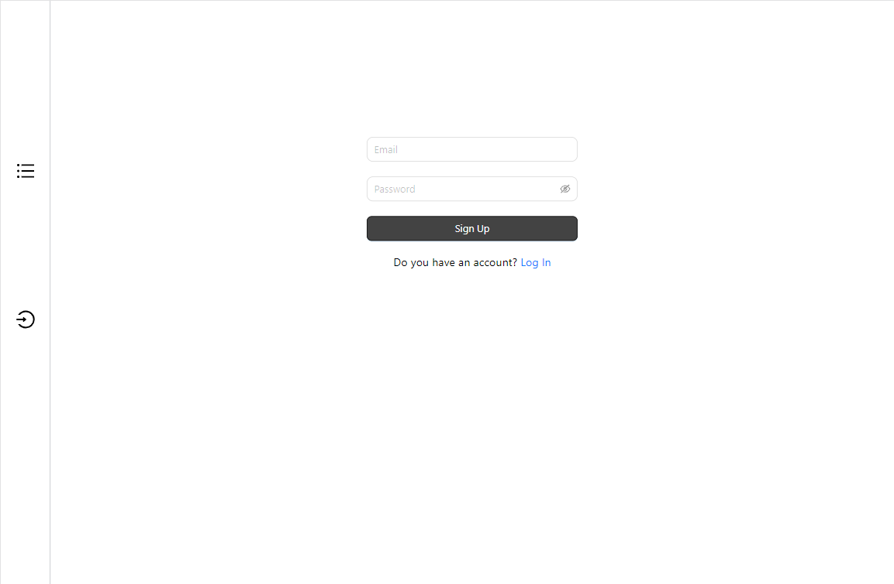
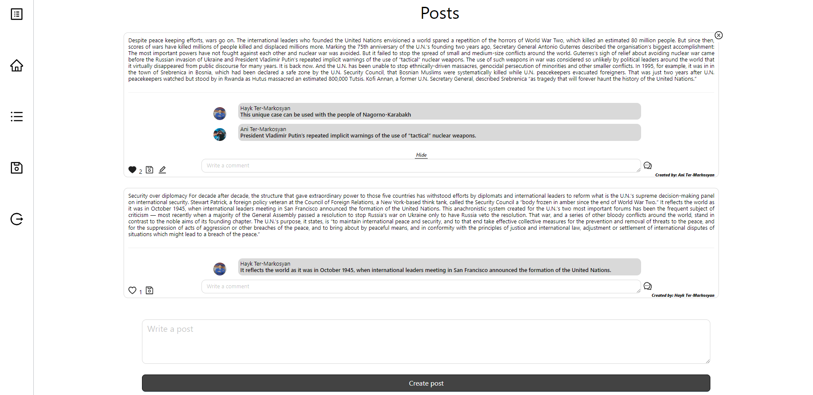
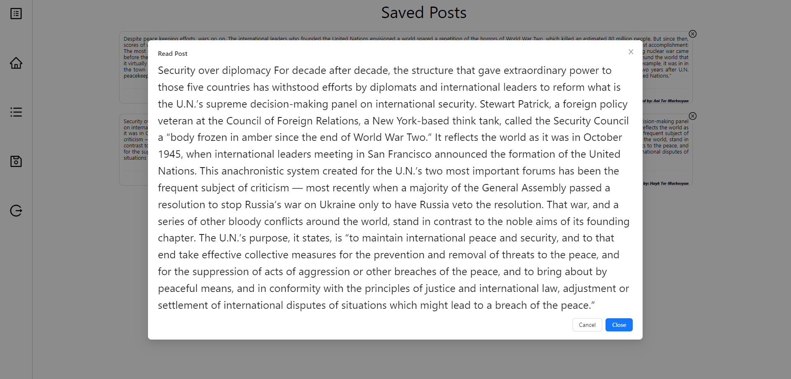
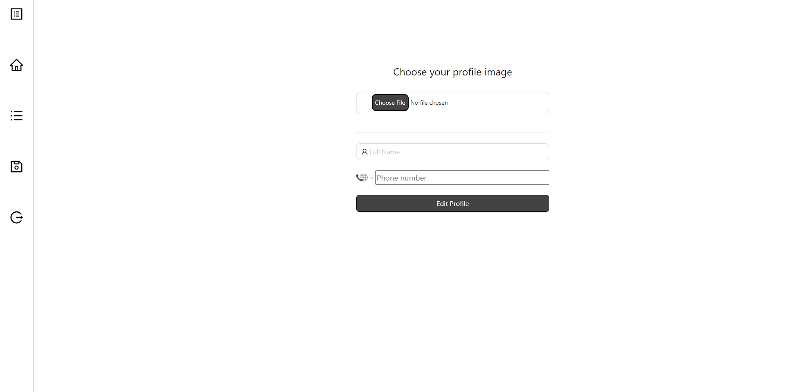
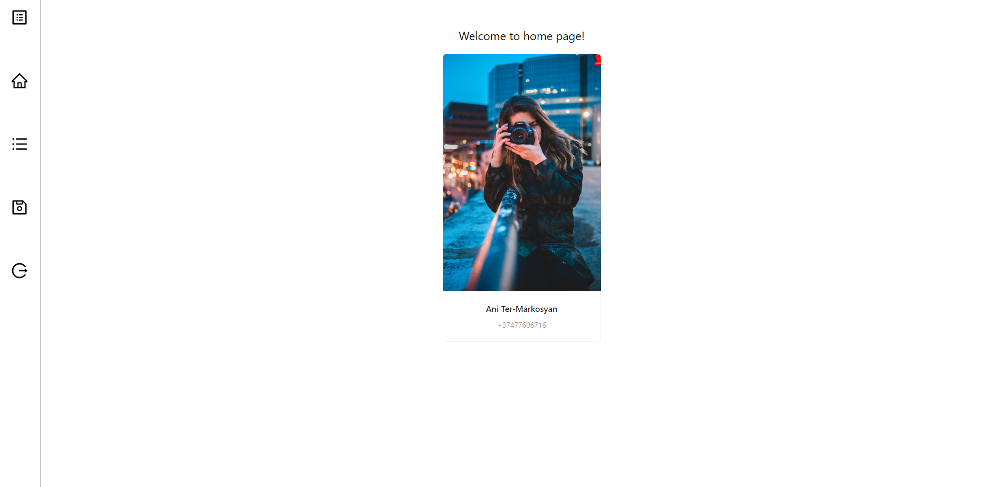

# Posts App

Posts App is web application that allows users to create and manage their 
own posts. It`s built using the PERN stack (PostgreSQL, Express.js,
React.js, and Node.js). 

## Features and Implementation

### Authentication



User Log In and Sign Up are handled by separate pages that appear when 
the user interacts with the Navigation component.

In order to make sure that all user information is kept safe. Passwords 
are never actually stored in the database. When a user signs up, their password
is salted and put through a hashing function from the BCrypt library 10 times. 
Only the result of that hashing function as well as the added salt is saved in 
the database as a password digest. When the user tries to log in again, that whole
process must be repeated, and they will only be authenticated if the result of 
the hashing function matches the password digest that is associated with 
their email.

```
async login(req, res, next) {
        const {email, password} = req.body;
        const user = await User.findOne({where: {email}});
        if (!user) {
            return next(ApiError.internal('User is not found'));
        }
        let comparePassword = bcrypt.compareSync(password, user.password);
        if (!comparePassword) {
            return next(ApiError.internal('Wrong password'));
        }
        const token = generateJwt(user.id, user.email);
        return res.json({token});
}
```

### Posts



On the backend, posts are stored in the database with columns for id, userId, text
and userName. 

Posts are rendered at /posts in the Posts component. This component displays all 
posts (comments, likes, etc.) ever created by registered users and in this 
component the user can create new posts by entering text, as well as leave 
comments and likes under already created posts. Also in this component, the user
can save the post he likes to himself in saved posts for further reading.

###Saved posts



Saved posts are rendered at /saved in the SavedPosts component. This component 
displays all the posts that this user has saved for further reading. When you 
click on a saved post, a modal window pops up for easier reading of the post.

###User profile

On the backend, users are stored in the database with columns for id, email, 
password, name, phoneNum and img.



When Sign Up, the user enters only the email and password, and the rest of the 
data (name, phone number and image) can be added at /profile using the Profile 
component.



All information related to the user is rendered at / in the Home component.

## Future Directions for the Project

###Attaching files

In the future it is planned to add the ability to attach files (images, 
videos, audio, etc.) when creating posts and comments.